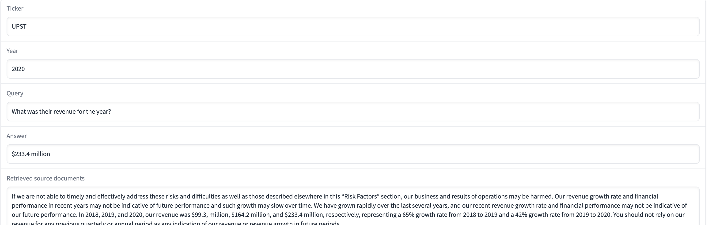

## Overview

In this tutorial, we will be creating an application that answers questions based on [SEC Form 10-K](https://en.wikipedia.org/wiki/Form_10-K) documents. These are financial performance summaries that all companies are required to file with the SEC annually. Analyzing these filings and extracting information from them is an important part of staying on top of financial data about public companies. The basic structure of this application will be a retrieval question answering system. The user will provide what company and year they want to ask questions about and the question they would like to ask. Based on the question, a text embedding model will retrieve relevant sections of the 10-K document, and then a language model will answer the question based on the retrieved text. See some [great](https://python.langchain.com/en/latest/modules/chains/index_examples/vector_db_qa.html#retrieval-question-answering) [materials](https://blog.langchain.dev/langchain-chat/) from [LangChain](https://python.langchain.com/en/latest/index.html) for more exploration on this type of application.

The goal of this tutorial is to show how we can build a prototype of this application using the MosaicML platform from start to finish. We will cover:
- Setting up your development environment and the MosaicML platform ([setup](#setup))
- Downloading and processing the data for domain specific pretraining of [MPT-7b](https://huggingface.co/mosaicml/mpt-7b) ([process and upload](#1-acquiring-the-sec-10-k-data), [MDS conversion](#2-mds-conversion))
- Finetuning MPT-7b on financial text ([finetuning](#3-finance-finetune-mpt-7b))
- Instruction finetuning MPT-7b on the data we used to build MPT-7b-instruct ([instruct finetuning](#4-instruct-finetune-mpt-7b))
- Deploying your finetuned MPT-7b and an Instructor embedding model for inference using the MosaicML inference service ([convert to Hugging Face](#5-convert-the-composer-checkpoint-to-a-huggingface-checkpoint), [deploy](#6-deploy-your-model-and-an-embedding-model))
- Using the MosaicML inference integration in LangChain to connect to your deployed models ([application](#7-application-with-gradio))
- Building a simple frontend with [gradio](https://gradio.app/) to tie everything together ([application](#7-application-with-gradio))
- Next steps you might take ([what's next](#what-next))

At the end of this tutorial, you will have a simple web application (pictured below) that answers questions about SEC Form 10-K documents using a model that you finetuned and deployed using MosaicML! All the normal caveats about language models and making things up apply, this is a simple prototype and not production ready, and there are a variety of avenues you can pursue after going through this tutorial to improve the quality and apply the MosaicML platform to your task :)




## Which MosaicML tools will we use?
- [LLM-foundry](https://github.com/mosaicml/llm-foundry): An open-source PyTorch library of tools for training, finetuning, evaluating, and deploying LLMs for inference.
- [Composer](https://github.com/mosaicml/composer): An open-source PyTorch library for easy large scale deep learning.
- [Streaming](https://github.com/mosaicml/streaming): An open-source PyTorch library for efficiently and accurately streaming data from the cloud to your training job, whereever that job is running.
- [MCLI](https://docs.mosaicml.com/projects/mcli/en/latest/): The command line interface for running training and inference jobs on the MosaicML platform.


## Setup

Jobs can be submitted to the MosaicML platform either using the [SDK](https://docs.mosaicml.com/projects/mcli/en/latest/training/working_with_runs.html#manage-a-run-with-the-sdk), or MCLI yamls. All commands in this tutorial are going to be run using MCLI yamls. For more MosaicML platform documentation, see the [MosaicML documentation](https://docs.mosaicml.com/projects/mcli/en/latest/), and for a detailed explanation of our yamls, see [training yaml documentation](https://docs.mosaicml.com/projects/mcli/en/latest/training/yaml_schema.html) and [inference yaml documentation](https://docs.mosaicml.com/projects/mcli/en/latest/inference/inference_schema.html). For understanding how this works, and what is actually running, there are a few important details to understand.

1) The MosaicML platform does not have permanent storage on the compute nodes. This means that all data will be streamed in/out to/from a cloud object store. In this tutorial we will use [MosaicML Streaming](https://github.com/mosaicml/streaming) to accomplish this. See [MosaicML setup](#mosaicml-platform-setup) for more details on setting up your cloud provider of choice.
1) The `command` section of the yaml is what will actually get run on the compute node. If you are trying to debug/run something locally, you should run what appears in the `command` section (after setting up your local environment).
1) The `parameters` section of the yaml is mounted as a single `.yaml` file at `/mnt/config/parameters.yaml`, which your `command` can then read from. This `parameters` section is how we will pass the training configuration parameters to the training script.


### MosaicML platform setup

Before starting this tutorial, you should make sure that you have access to the MosaicML platform. You'll need access to both training and inference services to complete this tutorial, although you can follow this tutorial up to the [deployment](#6-deploy-your-model-and-an-embedding-model) section if you just have access to training. Please [reach out](https://forms.mosaicml.com/demo?utm_source=inference&utm_medium=mosaicml.com&utm_campaign=always-on) if you would like to sign up, and reach out if you are already a customer and need to gain access to either service.

1. Go through the [getting started guide](https://docs.mosaicml.com/projects/mcli/en/latest/quick_start/getting_started.html).
1. Set up the object store of your choice, by following the [secrets guide](https://docs.mosaicml.com/projects/mcli/en/latest/resources/secrets/index.html) for your cloud provider of choice.
1. [Optional] Set up [Weights & Biases](https://docs.mosaicml.com/projects/mcli/en/latest/resources/integrations/wandb.html) or [CometML](https://docs.mosaicml.com/projects/mcli/en/latest/resources/integrations/comet.html) for tracking your experiments.

Once you have done all of this, you should be ready to get started with this tutorial!


### Local setup

All that is needed for local setup is to clone this repository and install a few dependencies, as the only thing you will be running locally is the final application. Everything else will be run through the MosaicML platform.
```bash
git clone https://github.com/mosaicml/examples
cd cd examples/examples/end-to-end-examples/sec_10k_qa
python -m venv examples-10k-venv
source examples-10k-venv/bin/activate
pip install -r requirements-cpu.txt
# Your api token can be found by running `mcli config`. This token is set an environment variable for the langchain integration
export MOSAICML_API_TOKEN=<your api token>
```


## How to follow this tutorial

Each section of this tutorial will have a command to run, which fields you need to edit before running the command, the expected input and output of that section, and a description of what is happening. The commands will be run using MCLI yamls (except the final front end which will run locally). All intermediate output will be written to cloud object store. Everywhere that a path is used, it will be of the form `CLOUD://BUCKET_NAME/path/to/my/folder/`. You will need to fill in the `CLOUD` (e.g. `s3`, `oci`, `gs`) and the `BUCKET_NAME` (e.g. `my-bucket`). The description of what is happening will be a high level overview of the steps that are being taken, and will not go into detail about the code, but the code and yamls will have detailed comments, and the description will contain pointers to where to learn more. We encourage you to read the yamls in detail to gain a better understanding of the various options that are available.


## 1) Acquiring the SEC 10-K data

We will use the [version of the 10-K data](https://huggingface.co/datasets/JanosAudran/financial-reports-sec) kindly uploaded to HuggingFace by `JanosAudran`. Note that reprocessing the data may improve the quality, as this version of the data appears to largely be missing tables, which are an important part of financial statements. Each row in this dataset corresponds to a sentence, so we will need to reprocess the data into full text documents before we can use it. Throughout this tutorial we will use the `large_full` subset of the data, which means that all the steps will take some time, as the dataset is fairly large. If you would like to simply go through all of the steps quickly and make sure that they run, you can instead use the `small_full` subset (throughout the tutorial), which contains a small subset of the full data.

The `process_and_upload_10ks.py` script will download the dataset from the HuggingFace hub, recombine the rows (which each contain a single sentence) into full documents, and save them individually to the cloud for access through this tutorial.

**Fields to replace with your values:** `REPLACE_WITH_YOUR_CLUSTER` (in the command), `CLOUD` (in the yaml), `BUCKET_NAME` (in the yaml) (replace `large_full` with `small_full` if you would like to run through the tutorial more quickly)

**Inputs:** the `JanosAudran/financial-reports-sec` dataset on HuggingFace

**Command:**
```bash
mcli run -f mcli-yamls/01_process_and_upload_10ks.yaml --cluster REPLACE_WITH_YOUR_CLUSTER
```

**Outputs:** the `sec-10ks-large` folder on your cloud object store, containing train, validation, and test splits of the 10k data, organized by ticker and year


## 2) MDS Conversion

As mentioned in the [MosaicML platform setup](#mosaicml-platform-setup) section, the MosaicML platform does not have permanent storage on the compute nodes. This means that all data will be streamed in and out from a cloud provider. In order to make this process as efficient as possible during a training run, we will convert the data into a format that is optimized for streaming, using our [Streaming](https://github.com/mosaicml/streaming) library. This format is called [MDS](https://docs.mosaicml.com/projects/streaming/en/stable/fundamentals/dataset_format.html#mds), and is a simple format that is optimized for streaming.

The `convert_10ks_to_mds.py` script will convert the data from step 1 into the MDS format. In addition to converting to MDS, it will concatenate samples together (separated by a special "end of sequence" token) to process as many tokens as possible in each sample. We will make use of the [`ConcatTokensDataset`](https://github.com/mosaicml/llm-foundry/blob/2733446bccce1800400b3a72a718bcc1fbff3da3/llmfoundry/data/data.py#L32) in LLM-foundry, and the [`MDSWriter`](https://docs.mosaicml.com/projects/streaming/en/latest/api_reference/generated/streaming.MDSWriter.html#streaming.MDSWriter) to perform this conversion. We will use the `mosaicml/mpt-7b` tokenizer, which is the same as `EleutherAI/gpt-neox-20b`, (`--tokenizer` argument), `<|endoftext|>` to separate examples in concatenated samples (`--eos_text` argument), and a maximum sequence length of 2048 (`--concat_tokens` argument).

**Fields to replace with your values:** `REPLACE_WITH_YOUR_CLUSTER` (in the command), `CLOUD` (in the yaml), `BUCKET_NAME` (in the yaml) (replace `large_full` with `small_full` if you would like to run through the tutorial more quickly)

**Inputs:** the `sec-10ks-large` folder from step 1

**Command:**
```bash
mcli run -f mcli-yamls/02_convert_10ks_to_mds.yaml --cluster REPLACE_WITH_YOUR_CLUSTER
```

**Outputs:** the `sec-10ks-large-mds` folder on your cloud object store, containing train, validation, and test splits of the 10k data, concatenated, tokenized, and converted to MDS format


## 3) Finance Finetune MPT-7b

Next, we will finetune our pretrained base model on the train split of the 10-K data in order to tune it on data that is in-domain for the end task of answering questions about 10-K forms. This process is called "domain tuning," and can be useful for adapting a model that has already been trained on a huge amount of data (e.g. MPT-7b) to a new domain. For this example, we will use the train/validation/test splits provided with the dataset, which splits by company. So each company (which has multiple years of 10-K forms) will only appear in one of the splits. We will use the validation split as validation data, and reserve the test split for our final testing of our application.

Please check out the [training yaml](./mcli-yamls/03_finetune_on_10ks.yaml) for all of the details. This yaml will load the pretrained weights for `mpt-7b` available on the [HuggingFace Hub](https://huggingface.co/mosaicml/mpt-7b), and then train using the normal causal language modeling objective on the 10-K form dataset that we processed in the previous step. The [training script](https://github.com/mosaicml/llm-foundry/blob/main/scripts/train/train.py) itself, is from LLM-foundry.

Note: this step will take a number of hours (~19hrs on 8xA100_80GB). Either use the `small_full` data from previous steps, or change `max_duration` in the YAML to something smaller if you would like a shorter training run.

**Fields to replace with your values:** `REPLACE_WITH_YOUR_CLUSTER` (in the command), `CLOUD` (in the yaml), `BUCKET_NAME` (in the yaml)

**Inputs:** the `sec-10ks-large-mds` folder from step 2

**Command:**
```bash
mcli run -f mcli-yamls/03_finetune_on_10ks.yaml --cluster REPLACE_WITH_YOUR_CLUSTER
```

**Outputs:** the checkpoints from your training, saved to the `save_folder` specified in the yaml


## 4) Instruct Finetune MPT-7b

Now that we have trained our model on in-domain financial text, we will train it to better follow instructions. For this step, we will follow the exact same process that we used to create [`mpt-7b-instruct`](https://huggingface.co/mosaicml/mpt-7b-instruct). Namely, we will finetune the model on instruction formatted data following the form of the [`databricks-dolly-15k` dataset](https://huggingface.co/datasets/databricks/databricks-dolly-15k), shown below. See [`mosaicml/dolly_hhrlhf`](https://huggingface.co/datasets/mosaicml/dolly_hhrlhf) for more details on the specific dataset we are using.

```python
INSTRUCTION_KEY = "### Instruction:"
RESPONSE_KEY = "### Response:"
INTRO_BLURB = "Below is an instruction that describes a task. Write a response that appropriately completes the request."
PROMPT_FOR_GENERATION_FORMAT = """{intro}
{instruction_key}
{instruction}
{response_key}
""".format(
    intro=INTRO_BLURB,
    instruction_key=INSTRUCTION_KEY,
    instruction="{instruction}",
    response_key=RESPONSE_KEY,
)

example = "James decides to run 3 sprints 3 times a week. He runs 60 meters each sprint. How many total meters does he run a week? Explain before answering."
fmt_ex = PROMPT_FOR_GENERATION_FORMAT.format(instruction=example)
```

For this second finetuning step, we will use the same training script as before, but with a different training yaml. The [training yaml](./mcli-yamls/04_instruction_finetune_on_dolly_hh.yaml) will load the same model class and architecture from the HuggingFace Hub, but will set `pretrained: false` and instead load the weights from the Composer checkpoint from the previous step using `load_path`. See this [finetuning yaml](https://github.com/mosaicml/llm-foundry/blob/main/scripts/train/yamls/finetune/7b_dolly_sft.yaml) for an example of how to finetune directly with Composer without using HuggingFace Hub (note the difference in the `model` section).

**Fields to replace with your values:** `REPLACE_WITH_YOUR_CLUSTER` (in the command), `CLOUD` (in the yaml), `BUCKET_NAME` (in the yaml), `PREVIOUS_RUN_NAME` (in the yaml)

**Inputs:** the final checkpoint from step 3

**Command:**
```bash
mcli run -f mcli-yamls/04_instruction_finetune_on_dolly_hh.yaml --cluster REPLACE_WITH_YOUR_CLUSTER
```

**Outputs:** the checkpoints from your training, saved to the `save_folder` specified in the yaml


## 5) Convert the Composer checkpoint to a HuggingFace checkpoint

Before we can deploy our model, we need to convert it into the standard HuggingFace checkpoint folder. We will use the [conversion script](https://github.com/mosaicml/llm-foundry/blob/main/scripts/inference/convert_composer_to_hf.py) from LLM-foundry to do this. This script will take the Composer checkpoint, and write out all the files that HuggingFace expects in a checkpoint folder. You can additionally add the `--hf_repo_for_upload` argument if you would like to upload directly to a private repo on the HuggingFace Hub (you will also need to [set the `HUGGING_FACE_HUB_TOKEN` environment variable](https://docs.mosaicml.com/projects/mcli/en/latest/resources/secrets/env.html) to do this).

Note: this conversion script is _specifically_ for MPT. If you have changed the model to a different HuggingFace model, you can use the `convert_composer_to_hf_transformers.py` script in _this_ repository instead.

**Fields to replace with your values:** `REPLACE_WITH_YOUR_CLUSTER` (in the command), `CLOUD` (in the yaml), `BUCKET_NAME` (in the yaml), `PREVIOUS_RUN_NAME` (in the yaml)

**Inputs:** the final checkpoint from step 4

**Command:**
```bash
mcli run -f mcli-yamls/05_convert_composer_to_huggingface.yaml --cluster REPLACE_WITH_YOUR_CLUSTER
```

**Outputs:** the `mpt-7b-hf` folder, containing the HuggingFace checkpoint files


## 6) Deploy your model and an embedding model

Now that we have our trained model, we will deploy it using MosaicML inference. This will allow us to use the model as an API. We will additionally deploy a pretrained text embedding model to perform retrieval of relevant text sections from the 10-K form as context for the language model to answer questions. For more examples of inference deployments, see [inference-deployments](../../inference-deployments/)


**Fields to replace with your values:** `REPLACE_WITH_YOUR_CLUSTER` (in the command), `CLOUD` (in the yaml), `BUCKET_NAME` (in the yaml), `PREVIOUS_RUN_NAME` (in the yaml)

**Inputs:** the HuggingFace format checkpoint from step 5

**Command**:
```bash
mcli deploy -f mcli-yamls/06a_deploy_llm.yaml --cluster REPLACE_WITH_YOUR_CLUSTER
```

**Command**:
```bash
mcli deploy -f mcli-yamls/06b_deploy_embedding_model.yaml --cluster REPLACE_WITH_YOUR_CLUSTER
```

**Outputs:** Two deployments, one for the language model and one for the embedding model


## 7) Application with gradio

Now that we've processed our data, trained our models, and deployed our models, we can run the application! We will use Gradio and LangChain to make a simple question answering interface.

We will make use of the MosaicML integration in LangChain for [LLMs](https://github.com/hwchase17/langchain/blob/master/langchain/llms/mosaicml.py) and [embeddings](https://github.com/hwchase17/langchain/blob/master/langchain/embeddings/mosaicml.py), and use the [`RetrievalQA`](https://python.langchain.com/en/latest/modules/chains/index_examples/vector_db_qa.html?highlight=retrievalqa) abstraction with the [`FAISS`](https://python.langchain.com/en/latest/modules/indexes/vectorstores/examples/faiss.html?highlight=faiss) to run the application locally.

Note that most of the time spent for each query is creating the embeddings, and we could significantly reduce the request time by precomputing and storing the embeddings.

Play around with the application and imagine ways you could improve it or apply a similar approach to your data!

You can find the names of your deployments by running `mcli get deployments`.

After running the `gradio` command, you should see link to your application. It is the link after `Running on local URL:`, _not_ the url after `Launching in *reload mode* on:`.

**Fields to replace with your values:** `REPLACE_WITH_YOUR_LLM_DEPLOYMENT_NAME` (in the command), `REPLACE_WITH_YOUR_EMBEDDING_DEPLOYMENT_NAME` (in the command), `CLOUD` (in the command), `BUCKET_NAME` (in the command)

**Command**:
```bash
gradio app.py --llm_endpoint_url https://REPLACE_WITH_YOUR_LLM_DEPLOYMENT_NAME.inf.hosted-on.mosaicml.hosting/predict --embedding_endpoint_url https://REPLACE_WITH_YOUR_EMBEDDING_DEPLOYMENT_NAME.inf.hosted-on.mosaicml.hosting/predict --remote_folder_path CLOUD://BUCKET_NAME/sec_10k_demo/data/sec-10ks-large/test --dataset_subset large_full
```


## What next?

Now that you've seen how to use MosaicML to train and deploy a language model, you can try it out on your own data! Here are some ideas for where to go from here:
- Play around with the hyperparameters and prompts for all of the components in [`app.py`](./app.py) and see how they change the output
- Try out different models from the HuggingFace Hub, both for the text embedding and for the LLM
- Try changing optimization parameters in the training yamls to see how they affect the training
- Try swapping in a new dataset, or applying the models to a new task
- Read more about the MosaicML components in this tutorial ([LLM-foundry](https://github.com/mosaicml/llm-foundry), [Composer](https://docs.mosaicml.com/projects/composer/en/latest/), [Streaming](https://docs.mosaicml.com/projects/streaming/en/latest/), [MCLI](https://docs.mosaicml.com/projects/mcli/en/latest/))
