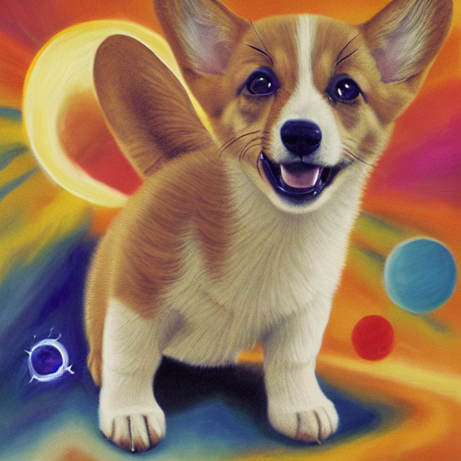

<p align="center">
  <picture>
    
  </picture>
</p>

<h2><p align="center">Stable Diffusion Dreambooth Finetuning</p></h2>

<h3><p align='center'>
<a href="https://www.mosaicml.com">[Website]</a>
- <a href="https://docs.mosaicml.com/">[Composer Docs]</a>
- <a href="https://docs.mosaicml.com/en/stable/method_cards/methods_overview.html">[Methods]</a>
- <a href="https://www.mosaicml.com/team">[We're Hiring!]</a>
</p></h3>

<p align="center">
    <a href="https://join.slack.com/t/mosaicml-community/shared_invite/zt-w0tiddn9-WGTlRpfjcO9J5jyrMub1dg">
        
    </a>
    <a href="https://github.com/mosaicml/examples/blob/main/LICENSE">
        
    </a>
</p>
<br />

This folder contains starter code for Stable Diffusion Dreambooth Finetuning. Dreambooth Finetuning works with as little as 5 images and allows a generative model to create scenes including specific people, objects, or pets.


# Quick Start

## Clone the repo and install requirements

```bash
git clone https://github.com/mosaicml/examples.git
cd examples
pip install -e ".[stable-diffusion-dreamboth]"
cd examples/stable_diffusion_dreambooth
```

## Train the model
```
composer main.py yamls/dreambooth.yaml
```

# Results
The default config is `yamls/dreambooth.yaml`. It trains only the Unet and language encoder of `Stable Diffusion v1-4` for `800 batches`. A default set of evaluation prompts are included in the yaml and will be logged to weights & baises every `50 batches`.

Results from the default config and the prompt  `"a majestic shiba inu doge wearing a blue sweater"`:
<p align="center">
  <picture>
    
  </picture>
</p>

Notes:
 - Low learning rates and short training times seem to work best. Training longer can quickly lead to overfitting.
 - If the results don't look like your object, you may need to train longer.
 - If the results ONLY look like your object (no background or other objects), you've trained too much.


# To train on different data

## 1. Add your own images
Replace the images in the `data/instance_data` directory with  5-15 images of your own subject. The images should be in png or jpg format. Images with varied poses and backgrounds work better.

## 2. Adjust instance and class prompts as needed

In `yamls/dreambooth.yaml` update:
-  `instance prompt: a photo of sks dog` to `instance prompt: a photo of sks <CLASS>` (for pictures of people: `person`, `man`, and `woman` work well)
-  `class_prompt: a photo of dog` to `class_prompt: a photo of <CLASS>`

# Using the MosaicML platform
This example can be run with the MosaicML platform by configuring the `cluster` and `gpu_type` parameters in `yamls/mcloud_run.yaml` then running:

```bash
mcli run -f yamls/mcloud_run.yaml
```

# Saving and Loading checkpoints

At the bottom of `yamls/dreambooth.yaml`, we provide arguments for saving and loading model weights. Please specify the `save_folder` or `load_path` arguments if you need to save or load checkpoints!

# Contact Us
If you run into any problems with the code, please file Github issues directly to this repo.
